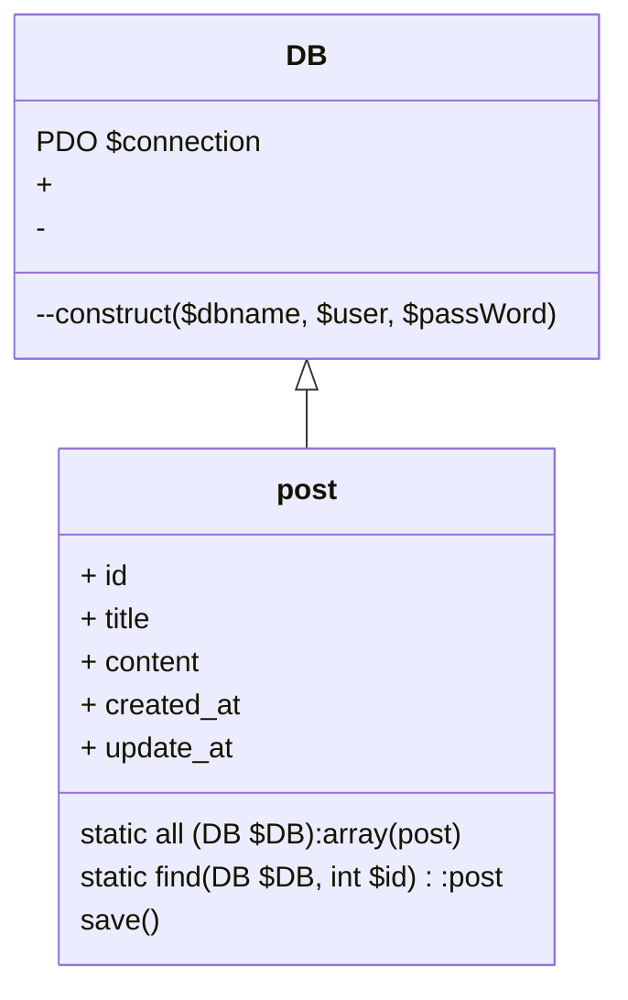

```mermaid
classDiagram
    class DB {
        PDO $connection
        + 
        - 
--construct($dbname, $user, $passWord)
        }
class post{ 
    + id
    + title
    + content
    + created_at
    + update_at
    
    static all (DB $DB):array(post)
    static find (DB $DB, int $id):post
    save()    
    }

DB <|-- post


```